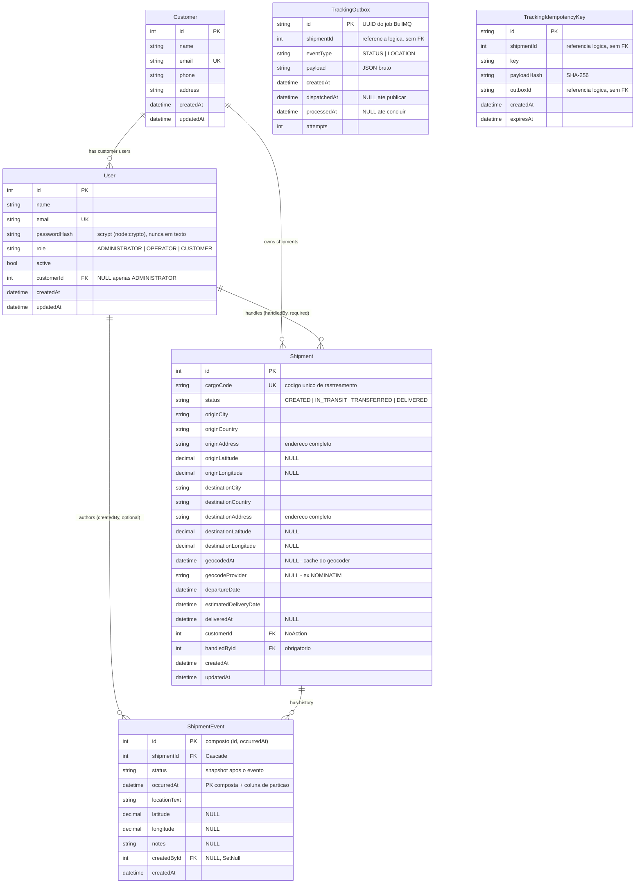

# Banco de Dados — modelo canônico

Fonte de verdade do modelo de dados: `prisma/schema.prisma`. Este documento descreve
tabelas, relacionamentos, índices e convenções. A definição de negócio do tracking
(endpoints, regras, transições) vive em [TRACKING_DEFINITION.md](./TRACKING_DEFINITION.md).

## Glossário PT→EN

| PT (spec)                                           | EN (código/banco)                                                                                        |
| --------------------------------------------------- | -------------------------------------------------------------------------------------------------------- |
| Cliente                                             | `Customer` (tabela `customers`)                                                                          |
| Operador / Usuário do sistema                       | `User` (tabela `users`)                                                                                  |
| Perfis: ADMINISTRADOR, OPERADOR, CLIENTE            | `role`: `ADMINISTRATOR`, `OPERATOR`, `CUSTOMER`                                                          |
| Viagem / Carga                                      | `Shipment` (tabela `shipments`)                                                                          |
| Código de carga                                     | `cargoCode`                                                                                              |
| Histórico / Movimentação                            | `ShipmentEvent` (tabela `shipment_events`)                                                               |
| Status: Iniciada, Em Trânsito, Transbordo, Entregue | `CREATED`, `IN_TRANSIT`, `TRANSFERRED`, `DELIVERED`                                                      |
| Local de origem / destino                           | `origin*` / `destination*` (colunas de `shipments`)                                                      |
| Local atual da carga                                | localização do **último `ShipmentEvent`** (`occurredAt DESC, id DESC`) — nunca persistida em `shipments` |
| Usuário responsável pela carga                      | `handledBy` (FK `handledById`)                                                                           |

## Modelo de dados (ER)



`TrackingOutbox.shipmentId`, `TrackingIdempotencyKey.shipmentId` e `TrackingIdempotencyKey.outboxId` são referências lógicas. O schema não declara FKs entre essas tabelas e `Shipment`/`TrackingOutbox`.

## Relacionamentos

| Relação                    | Cardinalidade | FK                                    | `onDelete` / `onUpdate` | Regra                                                                                                                                                                                                                              |
| -------------------------- | ------------- | ------------------------------------- | ----------------------- | ---------------------------------------------------------------------------------------------------------------------------------------------------------------------------------------------------------------------------------- |
| `Customer → Shipment`      | 1:N           | `shipments.customerId NOT NULL`       | `NoAction` / `NoAction` | Cliente com carga não pode ser apagado                                                                                                                                                                                             |
| `Customer → User`          | 1:N           | `users.customerId NULL`               | `NoAction` / `NoAction` | Obrigatório se `role ∈ {OPERATOR, CUSTOMER}`, NULL apenas `ADMINISTRATOR`; validado no domínio (Prisma não tem FK condicional)                                                                                                     |
| `User → Shipment`          | 1:N           | `shipments.handledById NOT NULL`      | `NoAction` / `NoAction` | **Toda carga exige usuário responsável**: o handler é o operador do próprio cliente da carga (cargas de integração usam o operador do cliente). Remoção de usuário com cargas é bloqueada pelo FK — desativar via `active = false` |
| `User → ShipmentEvent`     | 1:N           | `shipment_events.createdById NULL`    | `SetNull` / `NoAction`  | Autoria opcional preservada mesmo se o usuário for removido                                                                                                                                                                        |
| `Shipment → ShipmentEvent` | 1:N           | `shipment_events.shipmentId NOT NULL` | `Cascade` / `NoAction`  | Apagar a carga apaga seu histórico                                                                                                                                                                                                 |

> `NoAction` é o equivalente MSSQL de "bloquear a operação no banco" (o Prisma/MSSQL
> não expõe `Restrict`). O comportamento é o desejado: FK violada → erro no delete/update.

## Índices e justificativa (consultas da spec §2.2/§3)

| Índice                                                            | Consultas atendidas                                                                                                                                                |
| ----------------------------------------------------------------- | ------------------------------------------------------------------------------------------------------------------------------------------------------------------ |
| `shipments.cargoCode` UNIQUE                                      | `GET/PUT/DELETE /tracking/{cargoCode}`, `GET .../historico`, `POST /historico/{cargoCode}` — lookup por chave natural + unicidade                                  |
| `shipments(status)`                                               | `GET /tracking?status=`, `GET /tracking/status/{status}`                                                                                                           |
| `shipments(customerId, status)`                                   | `GET /tracking?idCliente=&status=` (filtros combináveis) + scoping do perfil `CUSTOMER`                                                                            |
| `shipments(handledById)`                                          | `GET /tracking?idOperador=`                                                                                                                                        |
| `shipments(departureDate, estimatedDeliveryDate)`                 | filtro por período de embarque/entrega                                                                                                                             |
| `shipments(status, estimatedDeliveryDate)`                        | listagem paginada/ordenada com teto de `limit`                                                                                                                     |
| `shipment_events(shipmentId, occurredAt DESC)`                    | `GET /tracking/{codigoCarga}/historico` (cronológica inversa) + **localização atual** (último evento por carga; na listagem via `distinct`, 1 consulta por página) |
| `shipment_events(status)`, `shipment_events(occurredAt DESC)`     | `GET /historico` (admin) com filtro/ordenação                                                                                                                      |
| `users(email)` UNIQUE, `users(role, active)`, `users(customerId)` | login futuro, listagem por perfil, vínculo cliente-usuário                                                                                                         |
| `customers(email)` UNIQUE (pré-existente)                         | resolução do vínculo do usuário CLIENTE                                                                                                                            |

## Volumetria de referência e limites

Números para dimensionar decisões (a solução **não** precisa sustentá-los na prática,
mas as decisões devem ser coerentes e os limites declarados):

| Dimensão                  | Volume                                                      | Derivação                                                              |
| ------------------------- | ----------------------------------------------------------- | ---------------------------------------------------------------------- |
| Clientes ativos           | 1.200                                                       | trivial                                                                |
| Cargas ativas simultâneas | 45.000                                                      | ~1,5–3M de cargas em 5 anos (ciclo médio ~15–30 dias)                  |
| Atualizações de status    | 120.000/dia (06h–20h ⇒ ~2,4 writes/s de pico)               | **~150–220M `shipment_events` em 5 anos** ← tabela crítica             |
| Portal do cliente         | 150–200 rps de pico, leitura predominante                   | atendido por `cargoCode` único + `(customerId, status)`                |
| Retenção do histórico     | 5 anos, consultável                                         | particionamento mensal + `MERGE`/`SWITCH` para arquivo (futuro)        |
| Disponibilidade           | 99,5% em horário comercial                                  | decisão de infra (AG/replica), não de schema                           |
| Sensibilidade             | clientes concorrentes; vazamento é incidente crítico (LGPD) | scoping por token (`User.customerId`); posse no lookup por `cargoCode` |

**Limites declarados:**

- Volume máximo dimensionado: ~3M cargas / ~220M eventos.
- `GET /historico` (admin global) **exige** filtro de período + paginação com teto — nunca listagem global sem janela.
- Writes de status são irrelevante em taxa (2,4/s de pico); o problema de escala é **tamanho de tabela/índices** → resolvido por particionamento (seção abaixo).
- Padrões no pior caso (projeto demo não os exerce): relações 1:N estáveis, FKs `NoAction` não degradam com volume.

## Particionamento de `shipment_events`

Tabela particionada **mensalmente** por `occurredAt` (migration
`20260917144500_partition_shipment_events_monthly`, SQL raw — Prisma não conhece
partition scheme).

### Regras de projeto

1. **PK composta `(id, occurredAt)`** — regra do MSSQL: toda chave única em tabela particionada deve conter a coluna de partição. Consequência no client: `findUnique({ id })` não existe para `ShipmentEvent` → usar where composto ou `findFirst`.
2. **`ALL TO ([PRIMARY])`, sem `NEXT USED`** — ambiente single filegroup (Docker). Variante multi-filegroup (prod futuro) passa a exigir, antes de cada `SPLIT RANGE`:
   ```sql
   ALTER PARTITION SCHEME ps_OccurredAt_Monthly NEXT USED [<filegroup>];
   ALTER PARTITION FUNCTION pf_OccurredAt_Monthly() SPLIT RANGE ('<yyyy-MM-01>');
   ```
3. **Split somente de partição futura vazia** (metadata-only; nunca `SPLIT RANGE` sobre partição com dados).

### Estrutura

- Partition function `pf_OccurredAt_Monthly (datetime2(7)) RANGE RIGHT`, fronteira inicial no primeiro dia do mês seguinte ao deploy + **24 meses futuros pré-criados vazios** (histórico existente fica na partição 1).
- Partition scheme `ps_OccurredAt_Monthly` → `ALL TO ([PRIMARY])`.
- Índice clusterizado `CI_shipment_events_occurredAt (occurredAt, id)` alinhado ao scheme; PK `(id, occurredAt)` como `NONCLUSTERED`.
- Índices secundários pré-existentes ficaram **não-alinhados** (1 partição cada); novos índices criados sem `ON` explícito herdam o scheme (alinhados) por default do MSSQL.

### Manutenção automática

- `npm run db:partition` (`prisma/partition-maintain.ts`): idempotente, lê `sys.partition_range_values` e faz `SPLIT RANGE` até cobrir 24 meses futuros; recusa split de fronteira não-futura.
- **Modo degradado aceitável**: se o script não rodar, o mês novo cai na última partição (overflow) e o próximo split regulariza — nada quebra.
- Agendamento em prod: cron externo chamando o script, ou SQL Server Agent job (`MSSQL_AGENT_ENABLED=true` no container) — fora do escopo dev.

### Retenção (5 anos, consultável)

Evolução futura, simétrica ao split: job/script com `SWITCH` da partição mais antiga para uma tabela de arquivo + `MERGE RANGE` após 60 meses. Somente documentado nesta fase.

### Convenções para migrations futuras

- Qualquer `migrate dev` que toque `shipment_events`: usar `--create-only` e **revisar o SQL manualmente** (Prisma pode emitir diffs que conflitam com o partition scheme).
- `prisma db pull` **proibido** como fonte de edição do schema desta tabela.

## Convenções MSSQL/Prisma

- **Sem `enum` nativo**: `status` e `role` são `String` (NVarChar) com valores UPPER; a validação dos valores permitidos vive no domínio, nunca em condicionais de controller.
- **Coordenadas**: `Decimal(9,6)` (precisão ~11 cm), não `Float` — serialização estável.
- **`onUpdate: NoAction`** em todas as FKs: os PKs são `IDENTITY` (nunca mudam) e o MSSQL proíbe múltiplos caminhos de cascade até a mesma tabela (`ShipmentEvent`).
- **`autoincrement()`** no lugar de `@default(autoincrement())` (particularidade do conector sqlserver).
- `migrate dev` no Prisma 7 **não** gera o client: rodar `prisma generate` após qualquer mudança de schema (`npm run db:migrate` já encadeia).
- `@@map` mantém os nomes de tabela/coluna estáveis; o client usa os nomes do model.

## Geolocalização (colunas)

- `originAddress` e `destinationAddress`: endereços completos obrigatórios, preservados como
  recebidos após trim. As coordenadas correspondentes são resolvidas pelo backend antes da criação.
- `origin*Latitude/Longitude`, `destination*Latitude/Longitude`: coordenadas com colunas nullable
  para compatibilidade histórica; novas cargas sempre persistem os dois pares completos.
- A localização de cada ocorrência vive em `shipment_events(locationText, latitude, longitude)`; a
  localização **atual** da carga é sempre a do último evento (`occurredAt DESC, id DESC`) — a tabela
  `shipments` não guarda posição (evita reescrita duplicada a cada atualização).
- O cache de endereços fica no Redis e é consultado antes do provedor configurado. `geocodedAt` e
  `geocodeProvider` permanecem como metadados opcionais da carga.
- A chamada externa fica atrás da port `GeocodingPort` na aplicação, implementada na
  infraestrutura — nenhum cliente HTTP no domínio ou na aplicação.

## Seed (`npm run db:seed`)

- Idempotente: upsert de `customer` por `email`, `user` por `email`, `shipment` por `cargoCode`.
- Eventos são inseridos **apenas** quando a carga não tem histórico (re-seed não duplica `shipment_events`).
- Massa: 15 customers, 14 users (2 admin, 6 operadores vinculados cada um ao seu cliente, 6 usuários CLIENTE vinculados a customers), 12 shipments (rotas BR + 2 internacionais) cobrindo todos os status, ~2–4 eventos por carga cobrindo `CREATED → IN_TRANSIT → TRANSFERRED → DELIVERED`.
- `passwordHash` usa scrypt (`node:crypto`, salt aleatório, comparação em tempo constante); o seed define a senha padrão de dev apenas no `create` (re-seed nunca reseta senhas) e migra o antigo placeholder uma única vez. Nunca expor em responses (presenters omitem o campo).
- A timeline de eventos deriva de `departureDate`/`estimatedDeliveryDate` (offsets proporcionais) — dados coerentes entre carga e histórico.

## Outbox e idempotência de tracking

Essas tabelas implementam a entrega durável entre a API, SQL Server, Redis/BullMQ e o worker. A API cria o outbox na mesma transação da aceitação da solicitação; respostas `202` significam que o evento foi aceito para processamento, não que o histórico já foi atualizado.

### `tracking_outbox` (`TrackingOutbox`)

Armazena cada solicitação bruta até o worker concluir seu processamento. `id` é UUID e também o ID determinístico do job BullMQ, permitindo que o dispatcher reconcilie entregas ausentes no Redis.

| Coluna         | Uso                                                                  |
| -------------- | -------------------------------------------------------------------- |
| `id`           | Chave primária UUID e identificador do job.                          |
| `shipmentId`   | Carga associada; referência lógica, sem FK declarada.                |
| `eventType`    | Tipo de evento (`STATUS` ou `LOCATION`).                             |
| `payload`      | JSON bruto necessário para processar a ocorrência.                   |
| `createdAt`    | Momento de criação do registro.                                      |
| `dispatchedAt` | Última publicação/reconciliação no BullMQ; `NULL` enquanto pendente. |
| `processedAt`  | Conclusão do evento; `NULL` enquanto não processado.                 |
| `attempts`     | Contador de tentativas de despacho.                                  |

Índices: `(dispatchedAt, createdAt)` localiza itens pendentes de despacho; `(shipmentId, eventType, processedAt, createdAt DESC)` apoia a validação serializada de transições não processadas. O processamento grava `shipment_events`, atualiza o estado atual quando a ocorrência é a mais recente e marca `processedAt` na mesma transação serializável.

### `tracking_idempotency_keys` (`TrackingIdempotencyKey`)

Guarda a chave de idempotência das solicitações de localização e o hash SHA-256 do corpo normalizado. A restrição única `(shipmentId, key)` impede reutilização da mesma chave para a mesma carga; `outboxId` aponta logicamente para a aceitação original, sem FK declarada. Repetir a chave e o mesmo conteúdo retorna a aceitação original; conteúdo diferente resulta em conflito.

As chaves expiram após cinco anos. Uma rotina do worker remove registros com `expiresAt` vencido a cada hora. Índices: unicidade em `(shipmentId, key)` para deduplicação e índice em `expiresAt` para a limpeza periódica.
